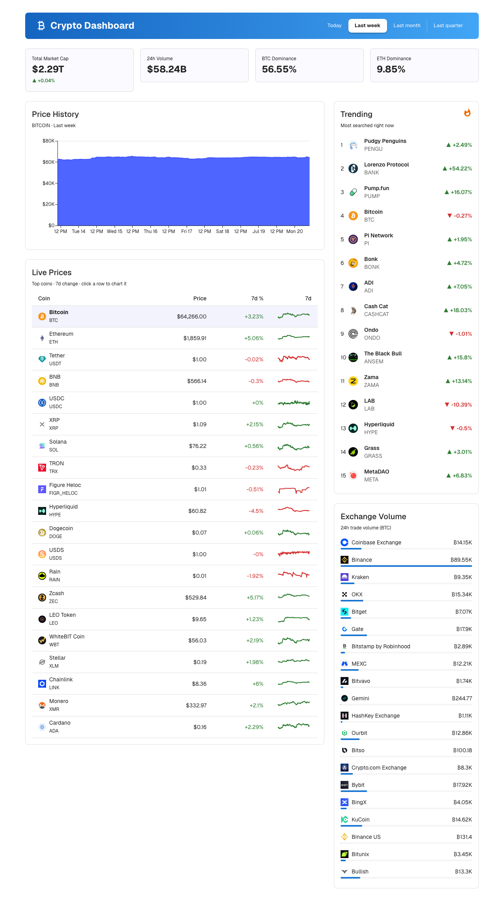
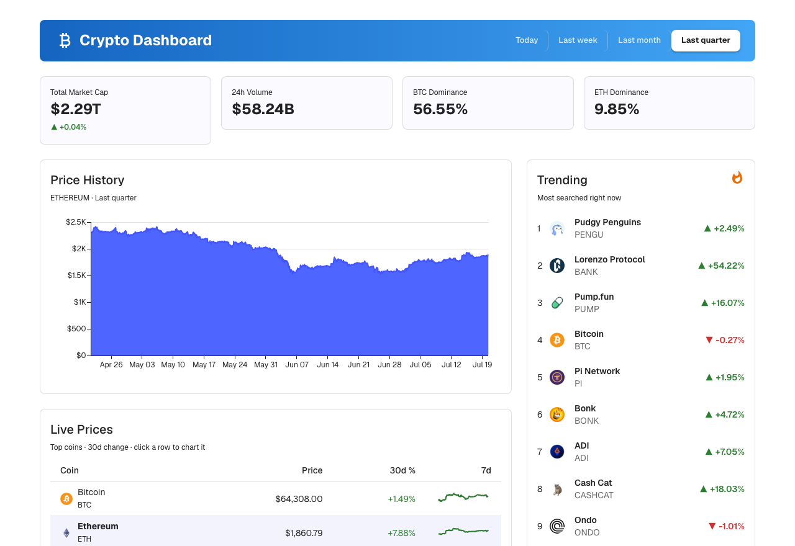
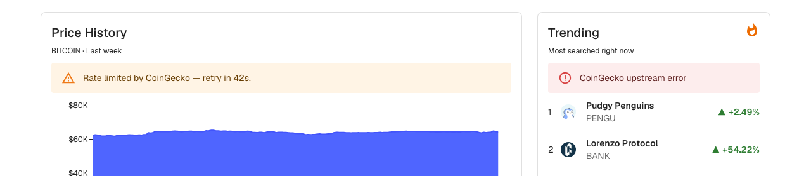
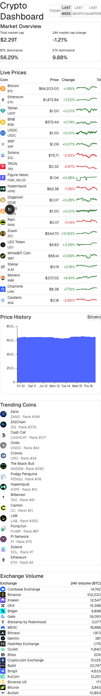

# Crypto Dashboard (v3)

[](https://github.com/benmcosker/crypto-dashboard-v3/actions/workflows/ci.yml)

A real-time cryptocurrency market dashboard built as a single **Next.js**
(App Router) app with **Material UI**, powered by the live
[CoinGecko API](https://docs.coingecko.com/). Successor to the
[Java/Angular v2](https://github.com/benmcosker/crypto-dashboard-v2) and the
original [React/Go v1](https://github.com/benmcosker/crypto-dashboard).

It surfaces five live metrics, all filterable by time period (**Today / Last week / Last month / Last quarter**):

| # | Metric | Source endpoint | Backend route |
|---|--------|------------------|----------------|
| 1 | Live price, % change & 7-day sparkline | `/coins/markets` | `/api/markets` |
| 2 | Total market cap + BTC/ETH dominance | `/global` | `/api/global` |
| 3 | Price-history chart (per coin) | `/coins/{id}/market_chart` | `/api/chart/{id}` |
| 4 | Trending coins | `/search/trending` | `/api/trending` |
| 5 | Exchange volume | `/exchanges` | `/api/exchanges` |

---

## Table of contents

- [Screenshots](#screenshots)
- [How it works](#how-it-works)
- [Time-period behavior](#time-period-behavior)
- [Prerequisites](#prerequisites)
- [Getting an API key](#getting-an-api-key)
- [Configuration](#configuration)
- [Running the app](#running-the-app)
- [Running the tests](#running-the-tests)
- [Running the e2e tests](#running-the-e2e-tests)
- [Production build](#production-build)
- [API reference](#api-reference)
- [Project structure](#project-structure)
- [Troubleshooting](#troubleshooting)

---

## Screenshots

**Dashboard overview** — all five metrics on one screen, with a time-period filter.



**Time-period filtering** — switching to *Last quarter* and selecting a different
coin re-scales the price-history chart to 90 days while the Live Prices table
falls back to its 30d change column (CoinGecko has no native 90d window).



**Graceful error handling** — when the backend or upstream API is unavailable,
each widget shows its own inline error message instead of taking down the page.



**Responsive layout** — the dashboard reflows to a single column on small screens.

<p align="center">
  
</p>

---

## How it works

```
┌────────────────────────────┐   /api/*   ┌──────────────────────┐  x-cg-demo-api-key  ┌─────────────┐
│ Browser (Next.js + Material) │ ────────▶ │ Next.js Route Handlers │ ───────────────────▶ │  CoinGecko  │
└────────────────────────────┘            └──────────────────────┘    (60s TTL cache)    └─────────────┘
```

- The **browser never calls CoinGecko directly.** All requests go through the
  app's own `/api/*` Route Handlers, so the API key stays server-side.
- The server **caches** every upstream response for 60 seconds (`lib/cache.ts`)
  to stay within the CoinGecko demo-plan rate limits and keep the UI snappy.
- Upstream/transport failures are mapped to a consistent JSON error shape
  `{ error, code, status }` (429 rate-limit + `Retry-After`, 404, 502/504, and
  400 for invalid input) via `lib/apiError.ts`. Raw upstream detail is logged,
  never forwarded to the client.
- The selected time period and chart coin are kept in the URL query string
  (via [`nuqs`](https://nuqs.dev)), so any chart view is shareable/bookmarkable
  — e.g. `/?period=90&coin=ethereum`.

---

## Time-period behavior

The period filter (Today / Last week / Last month / Last quarter) maps to
`1 / 7 / 30 / 90` days. Not every metric has a historical dimension, so the
filter applies where it's meaningful and the rest stay live:

- **Price-history chart** — uses the full day range for the selected period.
- **Live Prices % column** — uses CoinGecko's native change windows
  (24h / 7d / 30d). "Last quarter" has **no native 90-day window**, so the table
  shows the 30d change while the chart still renders the full 90 days.
- **Market overview, Trending, Exchange volume** — live snapshots with no
  historical dimension, so they stay current regardless of the selected period.

---

## Prerequisites

| Tool | Version | Check |
|------|---------|-------|
| **Node.js** | 20+ | `node --version` |
| **npm** | 10+ | `npm --version` |

---

## Getting an API key

This project uses a **CoinGecko Demo** API key (free).

1. Create an account at <https://www.coingecko.com/en/developers/dashboard>.
2. Generate a **Demo** API key (it looks like `CG-xxxxxxxxxxxxxxxx`).
3. Put it in `.env.local` (see below).

> The server sends the key as the `x-cg-demo-api-key` header against
> `https://api.coingecko.com/api/v3` (see `lib/coingecko.ts`).

---

## Configuration

Copy the example env file and fill in your key:

```bash
cp .env.local.example .env.local
```

```ini
# .env.local
COINGECKO_API_KEY=CG-your-demo-key-here
```

| Variable | Default | Purpose |
|----------|---------|---------|
| `COINGECKO_API_KEY` | _(required)_ | Demo API key sent as `x-cg-demo-api-key`. |

`.env.local` is gitignored — never commit it.

---

## Running the app

```bash
npm install        # first time only
npm run dev
```

Open **<http://localhost:3000>**. The dashboard loads live data immediately and
each widget revalidates itself periodically.

> The app hot-reloads on every save (`next dev`).

---

## Running the tests

Unit and component tests use **Vitest** + **React Testing Library**:

```bash
npm run test
```

Covers the CoinGecko client and TTL cache, the error-mapping helper, the
period-window logic, all 5 API route handlers (mocking `lib/coingecko.ts`),
and all 5 widget components in their loading / success / error states
(stubbing `global.fetch` via the `renderWithProviders` helper in
`test/render.tsx`, which wraps `SWRConfig` and nuqs's `NuqsTestingAdapter`).

---

## Running the e2e tests

End-to-end tests use **Cypress**, driving a real `next dev` server in a browser:

```bash
npm run e2e          # headless: boots next dev, runs all specs, tears it down
npm run e2e:open      # same, but opens the interactive Cypress runner
```

If you already have `npm run dev` running in another terminal:

```bash
npm run cy:run        # headless
npm run cy:open        # interactive
```

No `COINGECKO_API_KEY` is required for these to pass. Every spec calls
`cy.interceptDashboardApis()` before visiting the page, which stubs all five
`/api/*` routes with fixtures from `cypress/fixtures/`. The server-rendered
first paint still fetches real data (or errors, without a key) before Cypress
ever sees it, but SWR always revalidates each key on mount, so the browser
immediately re-fetches every `/api/*` route right into the stubs — tests
assert against that converged, deterministic state. Pass per-route overrides
to test error states, e.g. `cy.interceptDashboardApis({ markets: { statusCode: 429 } })`
(see `cypress/e2e/error-states.cy.ts`).

Specs live in `cypress/e2e/`:

| Spec | Covers |
|------|--------|
| `dashboard.cy.ts` | All five widgets render with fixture data; the period filter is visible. |
| `period-filter.cy.ts` | Picking a period updates the URL and re-fetches only the period-scoped widgets. |
| `coin-selector.cy.ts` | Changing the chart's coin updates the URL and re-fetches `/api/chart/{id}`. |
| `error-states.cy.ts` | 429 rate-limit and generic upstream-error alerts render correctly. |

---

## Production build

```bash
npm run build
npm run start
```

---

## API reference

All routes are served by the Next.js app itself under `/api`, backed by the
60s cache described above.

| Method | Route | Query params | Description |
|--------|-------|--------------|-------------|
| `GET` | `/api/markets` | `period=1\|7\|30\|90` | Top 20 coins by market cap, with 7-day sparkline and the matching native change window. |
| `GET` | `/api/global` | — | Total market cap and BTC/ETH dominance percentages. |
| `GET` | `/api/chart/{id}` | `period=1\|7\|30\|90` | Price history for a coin over the period. |
| `GET` | `/api/trending` | — | Currently trending coins. |
| `GET` | `/api/exchanges` | — | Top exchanges by 24h trade volume. |

Examples:

```bash
curl "http://localhost:3000/api/markets?period=7"
curl "http://localhost:3000/api/chart/bitcoin?period=90"
curl "http://localhost:3000/api/global"
```

---

## Project structure

```
crypto-dashboard-v3/
├── .env.local.example         # COINGECKO_API_KEY template
├── README.md
├── CLAUDE.md                  # condensed project notes
├── vitest.config.mts
│
├── app/
│   ├── layout.tsx              # fonts, InitColorSchemeScript
│   ├── Providers.tsx            # "use client" — MUI theme, SWRConfig, NuqsAdapter
│   ├── page.tsx                 # dashboard page, renders the 5 widgets in a Grid
│   └── api/
│       ├── markets/route.ts
│       ├── global/route.ts
│       ├── chart/[id]/route.ts
│       ├── trending/route.ts
│       └── exchanges/route.ts
│
├── components/                 # PeriodFilter + one directory per widget
│   ├── LivePrices/
│   ├── MarketOverview/
│   ├── PriceHistoryChart/
│   ├── TrendingCoins/
│   └── ExchangeVolume/
│
├── lib/
│   ├── coingecko.ts             # server-only CoinGecko fetch wrapper
│   ├── cache.ts                 # in-memory TTL cache
│   ├── apiError.ts              # {error, code, status} mapping
│   ├── period.ts                # Today/Week/Month/Quarter <-> day-count mapping
│   ├── fetcher.ts               # client-side SWR fetcher
│   └── types.ts
│
├── theme/theme.ts               # MUI theme
├── test/render.tsx              # renderWithProviders test helper
│
├── cypress/
│   ├── e2e/                     # dashboard.cy.ts, period-filter.cy.ts, coin-selector.cy.ts, error-states.cy.ts
│   ├── fixtures/                 # markets/global/chart/trending/exchanges.json
│   └── support/
│       ├── commands.ts           # cy.interceptDashboardApis()
│       └── e2e.ts
└── cypress.config.ts
```

---

## Troubleshooting

| Symptom | Fix |
|---------|-----|
| Widgets show a "CoinGecko upstream error" / "Rate limited" alert | Make sure `.env.local` has a valid `COINGECKO_API_KEY`. Without one, CoinGecko's public rate limit is much lower. |
| `429` rate-limit alert | Demo-plan rate limit. The 60s server-side cache usually prevents this; wait a minute and reload. |
| `Address already in use` on port 3000 | Free it: `lsof -ti tcp:3000 \| xargs kill -9`, or run `next dev -p <port>`. |
| Chart shows "Resource not found" | The selected coin id isn't a valid CoinGecko id — check `components/PriceHistoryChart/index.tsx`'s coin list. |
| Env changes not picked up | Restart `npm run dev` — Next.js only reads `.env.local` at startup. |
